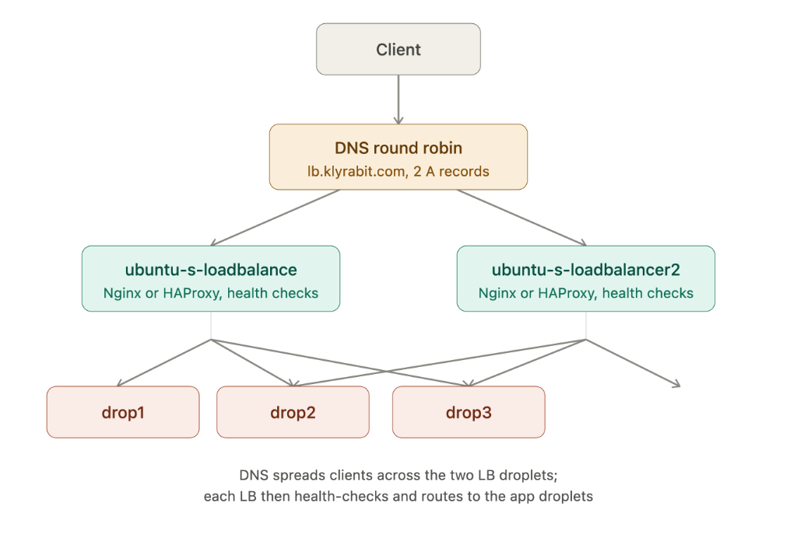
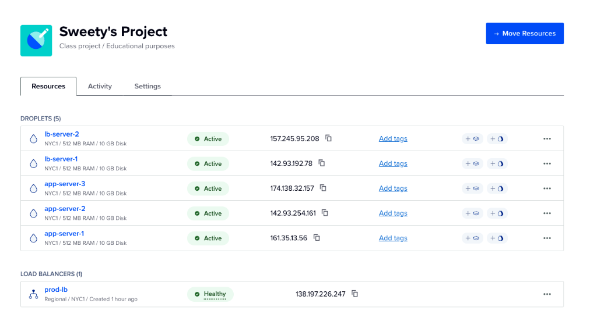
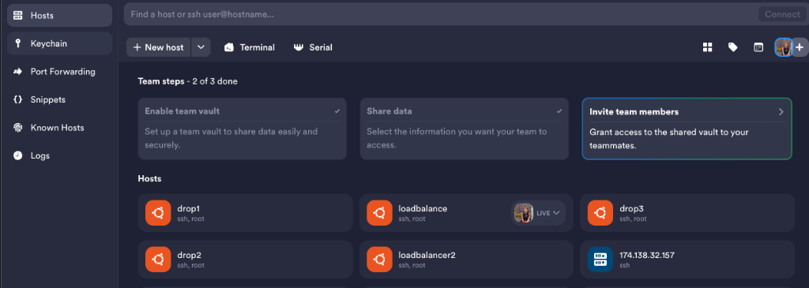
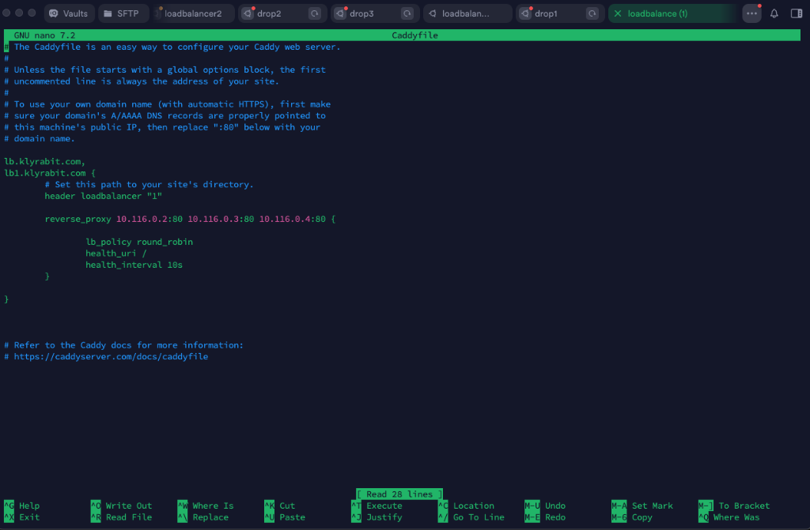

# DNS Load Balancing & Redundancy

This guide details the **Next Challenge** where we introduced a second load balancer droplet to establish high availability (HA) and redundancy using DNS Round Robin. If one load balancer goes down, the other continues serving traffic seamlessly.

See also: [Setup Guide](../readme.md) · [VPC](../vpc.md) · [Firewall](../firewall.md) · [Tailscale](../tailscale.md) · [Load Balancer](../loadbalancer.md) · [Tools](../tools.md)

---

## Architecture Overview

Instead of a single point of failure (one load balancer), we now have **two self-hosted load balancers** receiving public traffic. Both load balancers route requests to the same three backend application droplets over the private network.



---

## Droplet Inventory & Status

In the DigitalOcean control panel, we now have five active droplets and a managed load balancer:



### Droplet Configuration

| Droplet Name | Role | Public IP | Private IP (VPC) |
|--------------|------|-----------|------------------|
| `lb-server-1` (originally `loadbalance`) | Load Balancer 1 | `142.93.192.78` | `10.116.0.5` |
| `lb-server-2` | Load Balancer 2 | `157.245.95.208` | *VPC IP* |
| `app-server-1` (originally `drop1`) | Backend Node 1 | `161.35.13.56` | `10.116.0.2` |
| `app-server-2` (originally `drop2`) | Backend Node 2 | `142.93.254.161` | `10.116.0.4` |
| `app-server-3` (originally `drop3`) | Backend Node 3 | `174.138.32.157` | `10.116.0.3` |

---

## Step 1 — Termius Setup for Multiple Load Balancers

To manage the new structure, both load balancers are registered as hosts inside Termius:



1. SSH into the new load balancer droplet:
   ```bash
   ssh root@157.245.95.208
   ```
2. Update the system and install Caddy (see [loadbalancer.md](../loadbalancer.md#step-2--update-system-and-install-caddy)).

---

## Step 2 — Configure Caddyfiles

To identify which load balancer is responding during testing, we add a custom header to the responses (`header loadbalancer "1"` / `"2"`).

### Load Balancer 1 (`lb-server-1`)
Path: `/etc/caddy/Caddyfile`

We modify the Caddyfile to include the custom domain rules:



```caddyfile
lb.klyrabit.com,
lb1.klyrabit.com {
    # Custom response header to identify Load Balancer 1
    header loadbalancer "1"

    reverse_proxy 10.116.0.2:80 10.116.0.3:80 10.116.0.4:80 {
        lb_policy round_robin
        health_uri /
        health_interval 10s
    }
}
```

### Load Balancer 2 (`lb-server-2`)
Path: `/etc/caddy/Caddyfile`

We set up a matching configuration but adjust the header and test domain:

```caddyfile
lb.klyrabit.com,
lb2.klyrabit.com {
    # Custom response header to identify Load Balancer 2
    header loadbalancer "2"

    reverse_proxy 10.116.0.2:80 10.116.0.3:80 10.116.0.4:80 {
        lb_policy round_robin
        health_uri /
        health_interval 10s
    }
}
```

Apply the configuration on both load balancers:
```bash
sudo systemctl restart caddy
```

---

## Step 3 — DNS A Records Configuration

To distribute traffic between the two load balancers, multiple **A records** are registered in the DNS management console:

1. **Round Robin Load Balancing Record:**
   Add two separate `A` records for `lb.klyrabit.com`:
   - `lb.klyrabit.com` ──► `142.93.192.78` (LB1)
   - `lb.klyrabit.com` ──► `157.245.95.208` (LB2)

2. **Direct Access / Diagnostics Records:**
   Add individual `A` records to target a specific load balancer directly:
   - `lb1.klyrabit.com` ──► `142.93.192.78`
   - `lb2.klyrabit.com` ──► `157.245.95.208`

---

## Step 4 — Verification & Failover Testing

### 4.1 — Verify DNS Resolution
Verify that querying `lb.klyrabit.com` resolves to both load balancer IP addresses:

```bash
nslookup lb.klyrabit.com
```

**Expected output:**
```text
Name:   lb.klyrabit.com
Address: 142.93.192.78
Address: 157.245.95.208
```

### 4.2 — Verify Load Distribution (Active-Active)
Run multiple curl requests from your local machine to verify traffic is routed through both load balancers and ultimately hits all backend droplets:

```bash
for i in {1..10}; do curl -i -s http://lb.klyrabit.com | grep -E "loadbalancer:|<h1>"; done
```

**Expected output shows rotation of both load balancer nodes and backends:**
```text
HTTP/1.1 200 OK
loadbalancer: 1
    <h1>MY VPS DROP1</h1>

HTTP/1.1 200 OK
loadbalancer: 2
    <h1>MY VPS VPS2</h1>

HTTP/1.1 200 OK
loadbalancer: 1
    <h1>MY VPS VPS3</h1>

...
```

### 4.3 — Failover Demonstration
Simulate a catastrophic failure on Load Balancer 1 by stopping its Caddy service:

```bash
# On lb-server-1 (142.93.192.78)
sudo systemctl stop caddy
```

Now, query `lb.klyrabit.com` again from your local machine:
```bash
for i in {1..5}; do curl -i -s http://lb.klyrabit.com | grep -E "loadbalancer:|<h1>"; done
```

**Expected behavior:**
- Requests continue to succeed without dropping.
- The `loadbalancer` header consistently outputs `"2"`, proving all traffic has successfully failed over to `lb-server-2`:
```text
HTTP/1.1 200 OK
loadbalancer: 2
    <h1>MY VPS DROP1</h1>

HTTP/1.1 200 OK
loadbalancer: 2
    <h1>MY VPS VPS2</h1>
```

Start the Caddy service back up on `lb-server-1` to restore the active-active setup:
```bash
# On lb-server-1 (142.93.192.78)
sudo systemctl start caddy
```

---

## Checklist

- [x] Droplet `lb-server-2` (`157.245.95.208`) active in DigitalOcean
- [x] SSH connections to both load balancers configured in Termius
- [x] Custom `loadbalancer` response headers configured (`"1"` and `"2"`) in Caddyfiles
- [x] Round-Robin DNS A records set up for `lb.klyrabit.com` (pointing to both LBs)
- [x] Dedicated diagnostic records set up (`lb1.klyrabit.com`, `lb2.klyrabit.com`)
- [x] Verification checks demonstrate rotation between both LBs and backend nodes
- [x] Failover test successfully routes 100% of traffic to active LB when one is down

---

## Frequently Asked Questions (FAQ)

### Q1. Why do we use two additional load balancers, even though we did DNS load balancing?

**Answer:**
This architecture operates on a two-tier (layered) load balancing approach:

* **Layer 1 (DNS Round Robin):** Distributes client traffic across the two load balancers (`lb-server-1` and `lb-server-2`). If one load balancer goes down, DNS will eventually route lookups away from it, but this propagation is not instant (due to resolver caching) and is not automatically based on health.
* **Layer 2 (Self-Hosted Load Balancer Software):** These run real load balancer software (Caddy) that checks the health of the application droplets (`app-server-1`, `app-server-2`, `app-server-3`) and only sends traffic to the ones that are actually healthy, distributing load intelligently rather than blindly rotating.

#### What happens if we skip a layer?
* **If we skip Layer 2** (pointing DNS straight to backend application droplets): We lose health-aware routing entirely. DNS has no concept of *"this server is unhealthy, skip it"*, so we lose the ability to do real-time failover or true, even load distribution.
* **If we skip Layer 1** (pointing DNS to only a single load balancer): We lose high availability at the entry tier. If that single load balancer goes down, the entire application becomes inaccessible, introducing a single point of failure.

---

### Q2. Explain how DNS round-robin load balancing works and name two concrete failure modes it has in production.

**Answer:**
A DNS server holding multiple A/AAAA records for one hostname returns them in rotating order (or a shuffled list) on each query, so successive resolvers/clients are handed different IPs and traffic spreads roughly evenly over time.

**Failure modes in production:**
1. **No health awareness:** DNS has no feedback loop from the actual servers, so a dead backend keeps being handed out until someone manually removes the record or a health-check-integrated DNS service intervenes.
2. **Caching skew:** Resolvers and OS stub resolvers cache the answer for the TTL. A resolver serving thousands of users behind a corporate NAT can pin a huge fraction of traffic to one IP for the whole TTL window, breaking the "even" distribution assumption.

---

### Q3. Why is TTL a trade-off dial in DNS load balancing, and what would you set it to for a service expecting frequent backend churn (e.g., auto-scaling)?

**Answer:**
* **Low TTL** means resolvers re-query more often, so DNS-level changes (new IPs added, dead IPs removed) propagate faster—but it multiplies query volume on your authoritative DNS and adds latency if resolution isn't cached at all.
* **High TTL** reduces DNS load and lookup latency but means dead/stale records linger longer.

For auto-scaling workloads, set TTL low (30–60s) and pair it with active health-check-based DNS (e.g., Route 53 health checks, NS1, or a GSLB) rather than relying on TTL alone to signal capacity changes. TTL controls propagation speed, not correctness.

---

### Q4. What's the difference between DNS-based load balancing and Anycast, and when would you pick one over the other?

**Answer:**
* **DNS load balancing** hands out different unicast IPs to different clients from a single logical name—routing to the chosen IP is then ordinary unicast routing.
* **Anycast** advertises the *same* IP from multiple physical locations via BGP, and the network itself (not DNS) routes each client to the topologically nearest/least-cost announcing site.

Anycast gives you sub-second failover at the routing layer (withdraw the BGP route, traffic reroutes) and inherent geographic proximity routing, but requires BGP control and is mostly practical for large-scale or CDN/DNS-provider-level infrastructure. DNS LB is simpler to operate and sufficient when you don't control network edges or don't need routing-layer failover speed.
