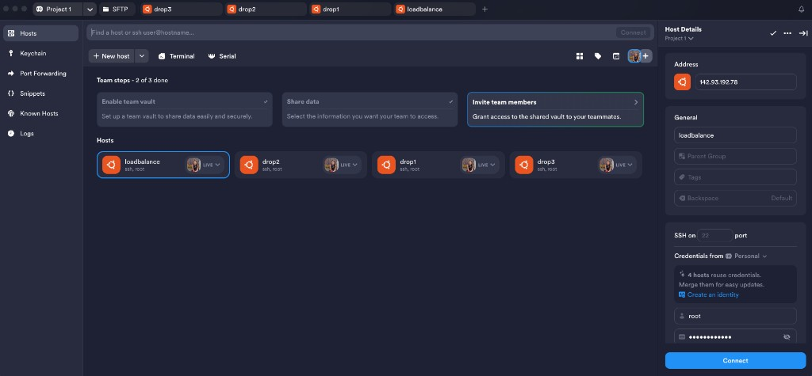

# Tools Used — DIY Load Balancer Project

This document lists the tools used to build and manage the self-hosted load balancer on DigitalOcean.

See also: [Setup Guide](readme.md) · [DigitalOcean](digitalocean.md) · [VPC](vpc.md) · [Firewall](firewall.md) · [Tailscale](tailscale.md) · [Load Balancer](loadbalancer.md)

---

## 1. Termius — SSH & VPS Management

**Website:** [https://termius.com](https://termius.com)

Termius is the main tool used to connect to and control all VPS droplets from one place. Instead of juggling separate terminal windows, every server is saved as a host and can be opened in its own tab.



### Why Termius for this project

- **Visual host dashboard** — all four droplets visible at once
- **One-click SSH** — connect to any VPS without retyping IP or credentials
- **Multiple tabs** — work on `drop1`, `drop2`, `drop3`, and `loadbalance` at the same time
- **SFTP** — transfer files (e.g. HTML, Caddyfile) without a separate FTP client
- **Keychain** — store SSH keys and passwords securely
- **Snippets** — save repeated commands (apt update, caddy reload, etc.)
- **Known Hosts** — track trusted server fingerprints

### Hosts configured in Termius

| Host label   | Role            | OS      | User | Connection |
|--------------|-----------------|---------|------|------------|
| `loadbalance`| Load balancer   | Ubuntu  | root | SSH :22    |
| `drop1`      | Backend VPS 1   | Ubuntu  | root | SSH :22    |
| `drop2`      | Backend VPS 2   | Ubuntu  | root | SSH :22    |
| `drop3`      | Backend VPS 3   | Ubuntu  | root | SSH :22    |

### Typical workflow with Termius

1. Open Termius and pick a host from the **Hosts** panel.
2. Click **Connect** (or double-click the host card).
3. Run setup commands in the terminal tab for that droplet.
4. Open another tab for the next VPS — repeat the same Caddy setup with different HTML.
5. Use the **SFTP** tab when you need to upload or edit files on a remote server.
6. Keep the **loadbalance** tab open last to configure the reverse proxy.

### Example: adding a new host in Termius

1. Click **NEW HOST** in the Hosts panel.
2. Set **Label** (e.g. `drop1`).
3. Set **IP address** from the DigitalOcean droplet page.
4. Set **Username** to `root`.
5. Add SSH key or password under credentials.
6. Save — the host appears in the dashboard with **LIVE** status when reachable.

---

## 2. DigitalOcean — Cloud Hosting

**Website:** [https://www.digitalocean.com](https://www.digitalocean.com)

DigitalOcean is used to create and run all droplets:

- 3 backend VPS (`drop1`, `drop2`, `drop3`) — Caddy static file servers
- 1 load balancer VPS (`loadbalance`) — DIY reverse proxy with health checks

Each droplet runs **Ubuntu 24.04 LTS** in **NYC1** and is accessed over SSH via Termius.

**Full droplet guide:** [digitalocean.md](digitalocean.md)

---

## 3. Caddy — Web Server & Load Balancer

**Website:** [https://caddyserver.com](https://caddyserver.com)

Caddy is used in two roles:

| Droplet type | Caddy role | Config |
|--------------|------------|--------|
| Backend (`drop1`–`drop3`) | Static file server | `file_server` on port 80 |
| Load balancer (`loadbalance`) | Reverse proxy + health checks | `reverse_proxy` to backend IPs |

Installed on each droplet via the official Caddy APT repository. Config lives at `/etc/caddy/Caddyfile` on every server.

---

## 4. Tailscale — Mesh VPN Overlay

**Website:** [https://tailscale.com](https://tailscale.com)

Tailscale creates a **WireGuard mesh network** between your Mac and backend droplets. Each node gets a stable `100.x.x.x` IP for private admin access — no inbound firewall holes required.

| Device | Tailscale IP |
|--------|--------------|
| `sweety-mac` | `100.124.44.3` |
| `ubuntu-s-drop1` | `100.80.105.50` |
| `ubuntu-s-drop2` | `100.107.34.9` |
| `ubuntu-s-drop3` | `100.122.84.2` |

**Full mesh networking guide:** [tailscale.md](tailscale.md)

---

## Tool stack summary

```
DigitalOcean  →  creates VPS droplets
      ↓
VPC           →  private production network (10.116.0.0/20)
      ↓
Termius       →  SSH into each VPS, manage all hosts visually
      ↓
Tailscale     →  mesh overlay for Mac → droplet private admin
      ↓
Caddy         →  serve HTML on backends, load-balance on LB VPS
```

| Tool          | Purpose                          |
|---------------|----------------------------------|
| Termius       | SSH client, multi-host control   |
| DigitalOcean  | VPS / droplet hosting            |
| Tailscale     | Mesh VPN — admin access overlay  |
| Caddy         | Web server + reverse proxy       |
| Ubuntu        | OS on all droplets               |
