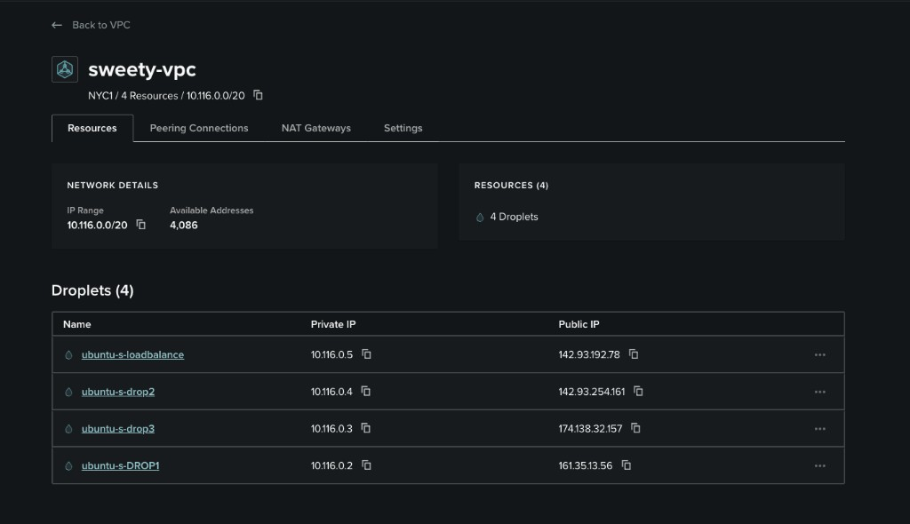

# VPC — Private Networking (`sweety-vpc`)

This project uses a DigitalOcean **VPC (Virtual Private Cloud)** so all droplets can talk to each other over a **private internal network**, while only the load balancer is exposed to the public internet.

See also: [DigitalOcean](digitalocean.md) · [Load Balancer](loadbalancer.md) · [Firewall](firewall.md) · [Tailscale](tailscale.md) · [Setup Guide](readme.md)

---

## What is a VPC?

A **VPC** is a private, isolated network inside a cloud region. Droplets placed in the same VPC get:

- A **public IP** (eth0) — reachable from the internet
- A **private IP** (eth1) — reachable only by other droplets in the same VPC

Think of it as a private LAN for your servers in the cloud.

```
┌─────────────────────────────────────────────────────────────┐
│                    sweety-vpc (NYC1)                        │
│                    IP range: 10.116.0.0/20                  │
│                                                             │
│   ┌──────────────┐                                          │
│   │ loadbalance  │  eth1: 10.116.0.5                       │
│   │ 142.93.192.78│───────┬──────────────┬──────────────┐   │
│   └──────────────┘       │              │              │   │
│                    private│      private │      private │   │
│                          ▼              ▼              ▼   │
│                   ┌──────────┐   ┌──────────┐   ┌──────────┐│
│                   │  DROP1   │   │  drop3   │   │  drop2   ││
│                   │10.116.0.2│   │10.116.0.3│   │10.116.0.4││
│                   └──────────┘   └──────────┘   └──────────┘│
└─────────────────────────────────────────────────────────────┘
         ▲
         │ public IP only here
    Internet / users
```

---

## Our VPC — `sweety-vpc`

All four droplets live inside one VPC in the **NYC1** region:



| Setting | Value |
|---------|-------|
| **VPC name** | `sweety-vpc` |
| **Region** | NYC1 |
| **IP range** | `10.116.0.0/20` |
| **Available addresses** | 4,086 |
| **Total resources** | 4 Droplets |

---

## Droplet IPs — public vs private

Each droplet has **two IPs**. The load balancer Caddyfile uses only the **private** ones for backend traffic.

| Droplet | Role | Private IP (eth1) | Public IP (eth0) |
|---------|------|-------------------|------------------|
| `ubuntu-s-loadbalance` | Load balancer | `10.116.0.5` | `142.93.192.78` |
| `ubuntu-s-DROP1` | Backend 1 | `10.116.0.2` | `161.35.13.56` |
| `ubuntu-s-drop3` | Backend 3 | `10.116.0.3` | `174.138.32.157` |
| `ubuntu-s-drop2` | Backend 2 | `10.116.0.4` | `142.93.254.161` |

View this table anytime in DigitalOcean: **Networking → VPC → sweety-vpc → Resources**.

---

## Why we use a VPC

### 1. Security

Backend servers (`drop1`, `drop2`, `drop3`) do **not** need to receive traffic directly from the internet for load balancing. The load balancer forwards requests over **private IPs** inside the VPC:

```caddyfile
reverse_proxy 10.116.0.2:80 10.116.0.3:80 10.116.0.4:80 {
        lb_policy round_robin
        health_uri /
        health_interval 10s
}
```

Only `ubuntu-s-loadbalance` (`142.93.192.78`) needs to be the public entry point.

### 2. Internal traffic stays internal

Traffic from load balancer → backends never leaves DigitalOcean's private network. It is faster and not routed over the public internet.

### 3. Simple IP management

Private IPs (`10.116.0.x`) are stable within the VPC. You assign them once in the Caddyfile and they stay consistent as long as droplets remain in the same VPC.

---

## How traffic flows

```
1. User opens browser
        │
        ▼
2. Hits load balancer PUBLIC IP
   http://142.93.192.78  (eth0 on loadbalance)
        │
        ▼
3. Caddy on loadbalance receives request on :80
        │
        ▼
4. Caddy forwards to a backend PRIVATE IP
   10.116.0.2 / .3 / .4  (eth1, inside sweety-vpc)
        │
        ▼
5. Backend Caddy serves static HTML
   "MY VPS DROP1" / "drop2" / "drop3"
        │
        ▼
6. Response returns through load balancer to user
```

Users never connect directly to `161.35.13.56`, `142.93.254.161`, or `174.138.32.157` for HTTP load-balanced traffic.

---

## Network interfaces on each droplet

When you run `ifconfig` on any droplet:

| Interface | Name | IP type | Example (loadbalance) |
|-----------|------|---------|------------------------|
| **eth0** | Public | Internet-facing | `142.93.192.78` |
| **eth1** | Private | VPC-internal only | `10.116.0.5` |
| **lo** | Loopback | Local machine only | `127.0.0.1` |

See [loadbalancer.md](loadbalancer.md) for the `ifconfig` screenshot on the load balancer droplet.

---

## Step 1 — Create or select a VPC

When creating droplets in DigitalOcean:

1. Go to **Create Droplet**.
2. Under **Choose a datacenter region**, select **NYC1**.
3. DigitalOcean assigns droplets to a VPC automatically (or pick `sweety-vpc` if prompted).
4. Create **all four droplets in the same region** so they share the same VPC.

> If droplets are in different regions, they **cannot** use private IPs to talk to each other.

---

## Step 2 — Verify VPC membership

1. Open [DigitalOcean Cloud](https://cloud.digitalocean.com).
2. Go to **Networking** → **VPC**.
3. Click **`sweety-vpc`**.
4. Open the **Resources** tab.
5. Confirm all 4 droplets appear with their **private** and **public** IPs.

Use the screenshot above as reference — every droplet should be listed under **Droplets**.

---

## Step 3 — Copy private IPs into the Caddyfile

On the load balancer, use **private IPs only** for backends:

| Private IP | Backend droplet |
|------------|-----------------|
| `10.116.0.2` | ubuntu-s-DROP1 |
| `10.116.0.3` | ubuntu-s-drop3 |
| `10.116.0.4` | ubuntu-s-drop2 |

Full Caddy setup: [loadbalancer.md](loadbalancer.md)

---

## Step 4 — Confirm private connectivity (optional)

From the load balancer droplet, test that backends respond on private IPs:

```bash
curl http://10.116.0.2
curl http://10.116.0.3
curl http://10.116.0.4
```

Each should return that VPS's HTML page.

---

## Public vs private — quick reference

| Use case | Which IP to use |
|----------|-----------------|
| SSH via Termius | **Public** IP |
| Browser / curl to load balancer | **Public** IP (`142.93.192.78`) |
| Caddy `reverse_proxy` backends | **Private** IP (`10.116.0.x`) |
| Health checks between LB and backends | **Private** IP |
| Backend-to-backend communication | **Private** IP |

---

## Checklist

- [ ] VPC `sweety-vpc` exists in **NYC1**
- [ ] IP range `10.116.0.0/20` — all 4 droplets listed under Resources
- [ ] Each droplet has eth0 (public) and eth1 (private)
- [ ] Load balancer Caddyfile uses `10.116.0.2`, `.3`, `.4` — not public IPs
- [ ] `curl` from loadbalance to private IPs works
- [ ] Public users only hit `142.93.192.78`
